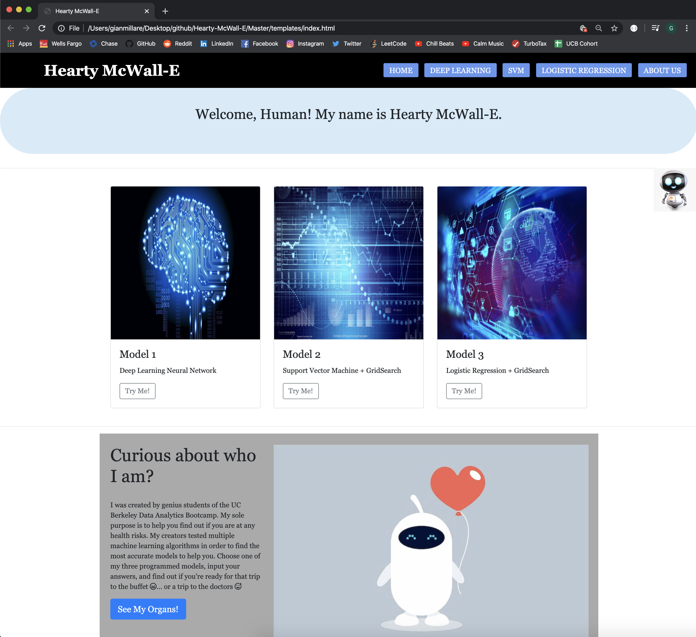
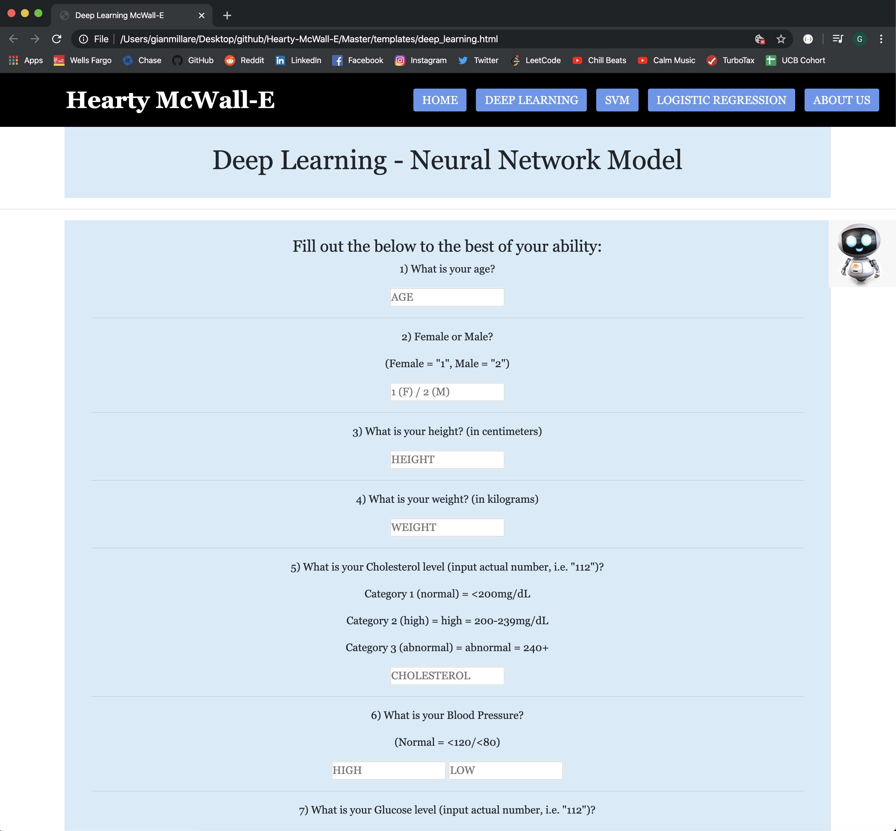
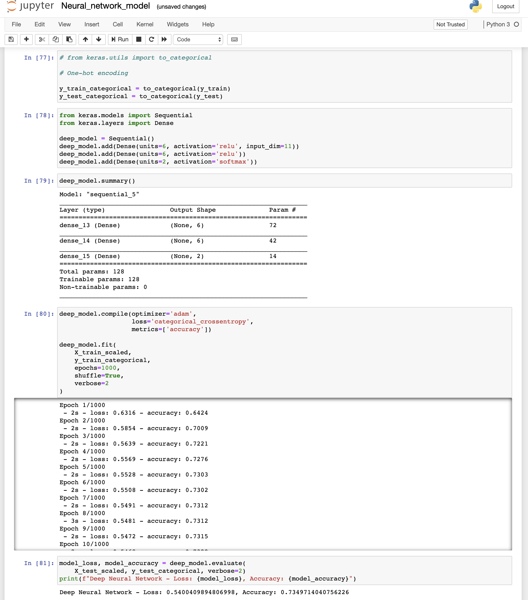
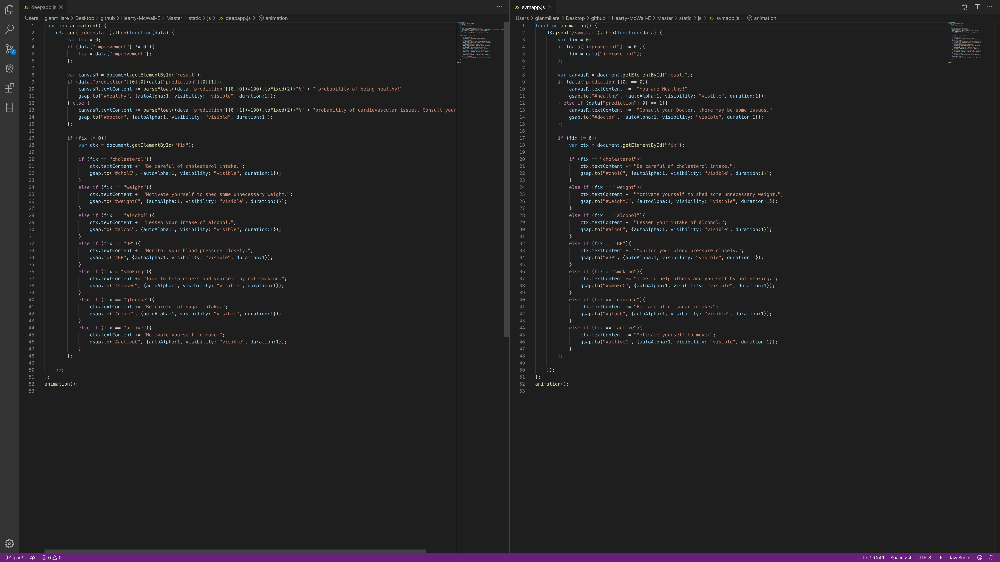
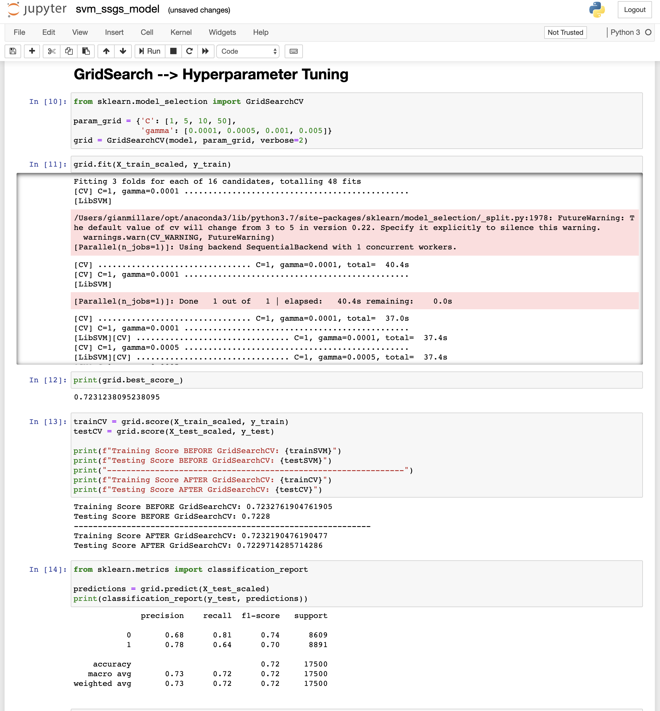
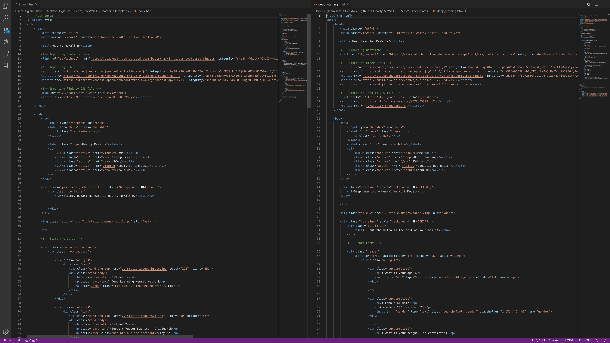

# Hearty-McWall-E

Few people have the tools and intellectual capability to diagnose themselves with cardiovascular disease. Using datasets taken from Kaggle and data.world, we created Machine Learning algorithms and models to (accurately) predict the average consumer's probability of having cardiovascular disease. This application consists of 3 of our most accurate models. The user will input (simple) answers to the best of their ability, and our friend "Hearty McWall-E" will determine the probability of the user's cardiovascular risk.

-------------------------------------------------------------------------------------------------------------------

### Home Page Preview

### Interactive Page Preview

### Python Deep Learning Preview

### Javascript Preview

### Python SVM Preview

### HTML & CSS Preview

